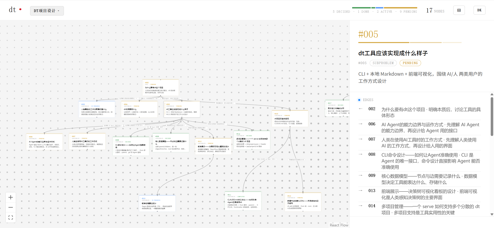
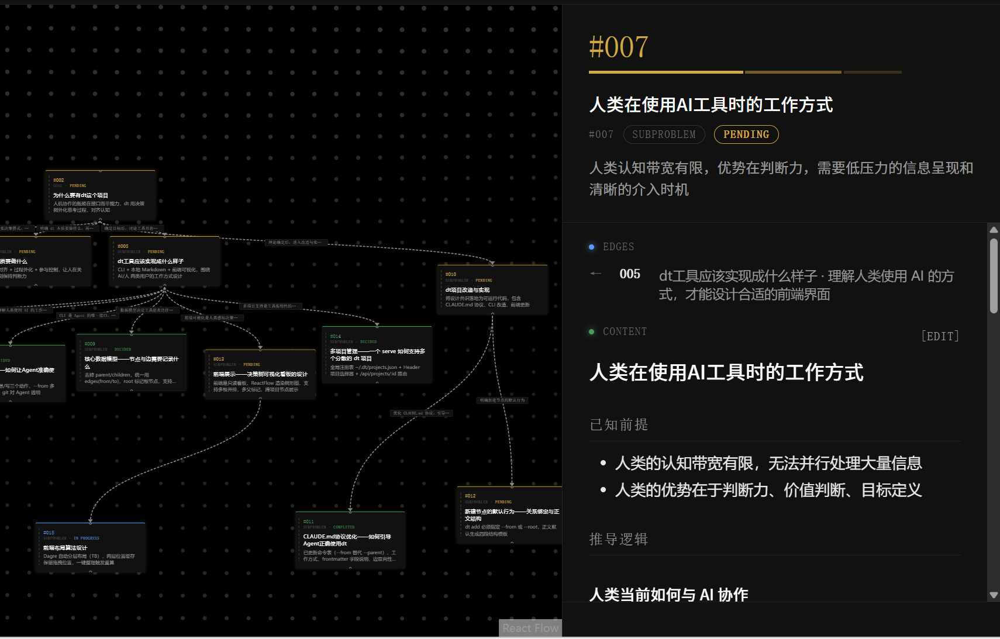
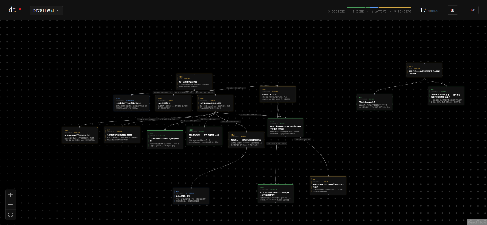

# dt — Decision Tree CLI

> 让 AI 知道你怎么想的，而不只是你要什么。

你描述需求，AI 开始生成。但它没有看到你脑子里的假设、边界和判断依据。

你们完成了一次对话，结论有了——但推导过程消失了。下次你自己也想不起来为什么当初这样决定。

你用 AI 做完一个项目。有人问你：这个地方为什么这样设计？你发现自己只能再去问 AI。

**dt 把这个过程记录下来。** 每一个节点存一次推导：前提是什么、逻辑是什么、达成了什么共识。AI 下次打开项目，直接站在你们已经对齐的地方继续工作。

---

## 演示

**决策树全局视图（浅色模式）**



每个节点展示标题、类型、状态。点击节点打开详情面板，查看完整的推导过程。

**节点详情面板——推导记录**



每个节点记录四层结构：已知前提 / 认知起点 / 推导逻辑 / 讨论共识。这是 AI 和人共享的"为什么"，不是 AI 单方面的结论。


**暗色模式**



---

## 这解决了什么

**如果你是开发者（用 Claude Code / Cursor）**

每次新会话都要重新交代背景。AI 推进太快，你来不及确认每个假设是否对齐。最终产物是 AI 的，改动时你不知道为什么这样做。

dt 让你的推导过程变成结构化文件——下一个 AI 读完，直接从你们已对齐的地方继续，不用重新猜你的意图。

**如果你每天用 AI 辅助思考（但不一定写代码）**

AI 回答太快，没有给你留下思考的空间。你有很多没说出口的判断标准，AI 不知道，但它不会停下来问。

dt 强迫双方慢下来——你先把判断依据写清楚，AI 才能在你真正理解的地方往下推。

**对所有人**

当你的思考图足够完整，可以让任何 AI Agent 调用它去执行任务。你的判断逻辑是结构化的，可追溯的，是你自己的。

---

## 安装

```bash
git clone https://github.com/Ted2020910/deeptree.git
cd deeptree
npm install
npm run build
npm link          # 全局注册 dt 命令
```

---

## 快速开始

```bash
# 在项目目录初始化决策树
dt init "项目名称"

# 查看当前状态
dt tree

# 添加根节点（你要解决的核心问题）
dt add goal "我们要解决什么问题" --root

# 拆解子问题
dt add subproblem "第一个子问题" --from 001

# 更新节点状态
dt update 003 --status decided --summary "已确定方案 B"

# 启动可视化界面
dt serve
```

会话开始时，AI 执行 `dt tree` 了解当前状态，然后直接在你们上次对齐的节点上继续工作。

---

## 数据结构

每个节点是一个本地 Markdown 文件，存放在 `.dt/nodes/` 下：

```markdown
---
id: '003'
title: 人类真实的工作决策模式是什么
summary: 任务分探索性与确定性，拆分是思考方式，回溯困境是人被淹没后失去判断力
type: subproblem
status: decided
root: false
edges:
  - target: '002'
    type: from
    summary: 从第一性原理理解人类决策模式，是设计 dt 的前提
  - target: '004'
    type: to
    summary: 理解决策模式后，推导 dt 本质要做什么
---

## 已知前提
（来自其他节点或外部的既有共识、约束条件）

## 认知起点
（这个问题是什么，边界在哪里）

## 推导逻辑
（分析过程、方案比较、权衡。记录"为什么"比"是什么"更有价值）

## 讨论共识
（达成的结论。讨论进行中时可为空）
```

四层结构的意义：AI 和人共享同一份推导依据，不只是结论。

### 数据模型要点

- **无 parent/children 字段**：关系统一通过 `edges` 表达
- **edges.type**：`from` = 本节点来自目标节点，`to` = 本节点指向目标节点
- **双向自动维护**：写入一侧的边，系统自动补全反向边
- **root 字段**：`true` 表示根节点，支持多根
- **跨项目引用**：`target: 'projectId::nodeId'` 格式，动态解析

---

## 核心命令

### 决策树操作

| 动作 | 命令 | 说明 |
|------|------|------|
| 看 | `dt tree` | 全局结构，自动检测用户编辑，多根并排 |
| 看 | `dt status` | 项目概览（节点统计、根节点列表） |
| 看 | `dt show <id>` | 节点详情（frontmatter + 正文） |
| 想 | `dt add <type> "标题" --from <id>` | 添加节点，指定父节点 |
| 想 | `dt add <type> "标题" --from <id> --from <id2>` | 多父节点 |
| 想 | `dt add <type> "标题" --root` | 添加根节点 |
| 想 | `dt link <src> <tgt> "摘要" --direction from\|to` | 在已有节点之间建立边 |
| 想 | `dt link <src> "proj::id" "摘要" --depth 2` | 跨项目引用 |
| 写 | `dt update <id> --status/--title/--summary/--type` | 更新结构化字段 |
| 写 | `dt update <id> --root true\|false` | 设置根节点标记 |

节点正文通过直接编辑 `.dt/nodes/xxx.md` 来更新，无需 CLI。

### 项目管理

| 命令 | 说明 |
|------|------|
| `dt init "名称"` | 初始化项目并自动注册到全局列表 |
| `dt register [路径]` | 注册已有项目 |
| `dt projects` | 列出所有注册项目 |
| `dt serve` | 启动可视化服务 |

---

## 多项目支持

```bash
cd ~/code/project-a && dt init "项目 A"
cd ~/code/project-b && dt register

dt projects   # 查看所有注册项目
dt serve      # 任意目录启动，自动加载所有项目
```

跨项目引用：

```bash
dt link 009 other-project::015 "依赖其 API 设计结论" --depth 2
```

---

## 可视化界面

`dt serve` 启动本地 Web 服务器（默认 `http://localhost:3000`）：

- **Canvas**：交互式决策树图，支持拖拽、缩放
- **Dagre 自动布局**：节点按层级自动排列
- **一键整理**：Header 右侧 `⊞` 按钮重新运行布局
- **Detail Panel**：点击节点打开编辑面板，支持 Markdown 预览与内容编辑
- **实时同步**：文件变更通过 WebSocket 自动推送前端刷新
- **双主题**：`[LT]` / `[DK]` 切换亮色与暗色

---

## 与 Claude Code 集成

`dt init` 会在项目根目录写入 `CLAUDE.md`，告知 Claude Code：

1. 会话开始时先执行 `dt tree` 了解当前状态
2. 遵循**对齐原则**——逐步确认理解，暴露推导过程，主动标记不确定性
3. 使用四层正文结构记录每个节点的讨论

---

## 节点类型

| 类型 | 用途 |
|------|------|
| `goal` | 目标或根问题 |
| `subproblem` | 子问题拆解 |
| `solution` | 方案 |
| `evaluation` | 方案评估 |
| `reflection` | 回顾与复盘 |

---

## License

MIT
